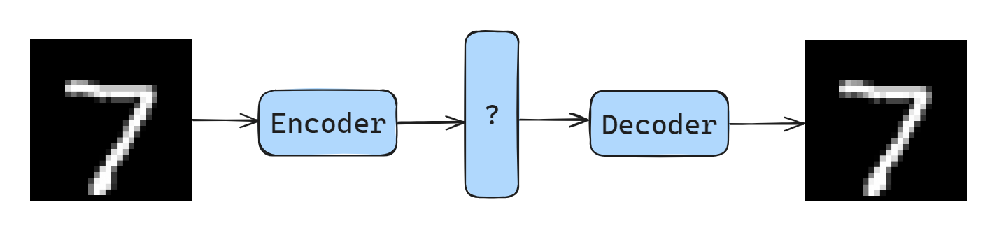

# MNIST Digit Generation with a Variational Autoencoder (VAE)

The Variational Autoencoder is a form of generative model that leverages Gaussian distributions and input reconstruction to generate data. In this repository, we will apply this model to the MNIST dataset to generate digits. Although this is a trivial exercise, it is a good practice of VAEs.

## High Level Intuition

To understand what a Variational Autoencoder is, we first need to understand what an Autoencoder is.

### Autoencoders

An autoencoder is comprised of two different multilayer perceptrons, which we call (1) an encoder (2) and decoder. If we combine these two MLPs and train the joined model with a *reconstruction loss* on the trivial task of reconstructing the provided input, we can make something interesting happen. Consider the architecture below.

Imagine the input reconstruction task, but with a layer in between the encoder and decoder - which we will call the *latent* layer, or vector. If we compress the dimensions of this vector as much as possible while maintaining the overall model's ability to reconstruct the input, then this latent vector is effectively serving as a compressed representation of the original input. This is the goal of an autoencoder, which can be applied to solve many problems. Perhaps the most salient application in modern ML is Embedding models.

### Generation

While autoencoders are incredibly useful, we cannot use them to generate data, since they are simply trained to reconstruct a provided input. If we slice off the encoder and only use a decoder, the inputs to the decoder are not well defined enough for us to leverage the "generation" capabilities of the decoder.

To achieve the generative capabilities of the VAE, we introduce a latent loss alongside the reconstruction loss, and model the generative task as one where we are sampling from a mixture of Gaussian models. For instance, in the case of the MNIST dataset, we can imagine the latent layer as being a mixture of 10 Gaussian distributions, each corresponding to one of the 10 digits we can generate. Generating a digit, then, becomes a case of randomly sampling from this distribution.

## Resources
1. Towards Data Science - Understanding Variational Autoencoders [[Link](https://towardsdatascience.com/understanding-variational-autoencoders-vaes-f70510919f73)]
2. CodeEmporium - Variational Autoencoders Explained [[Link](https://youtu.be/fcvYpzHmhvA?si=U3xpxFgmrZhflG9p)]
